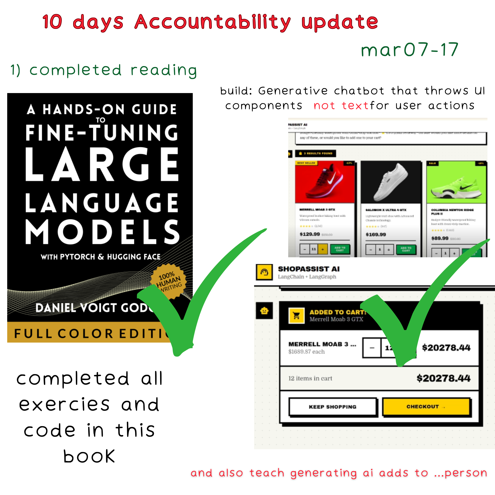
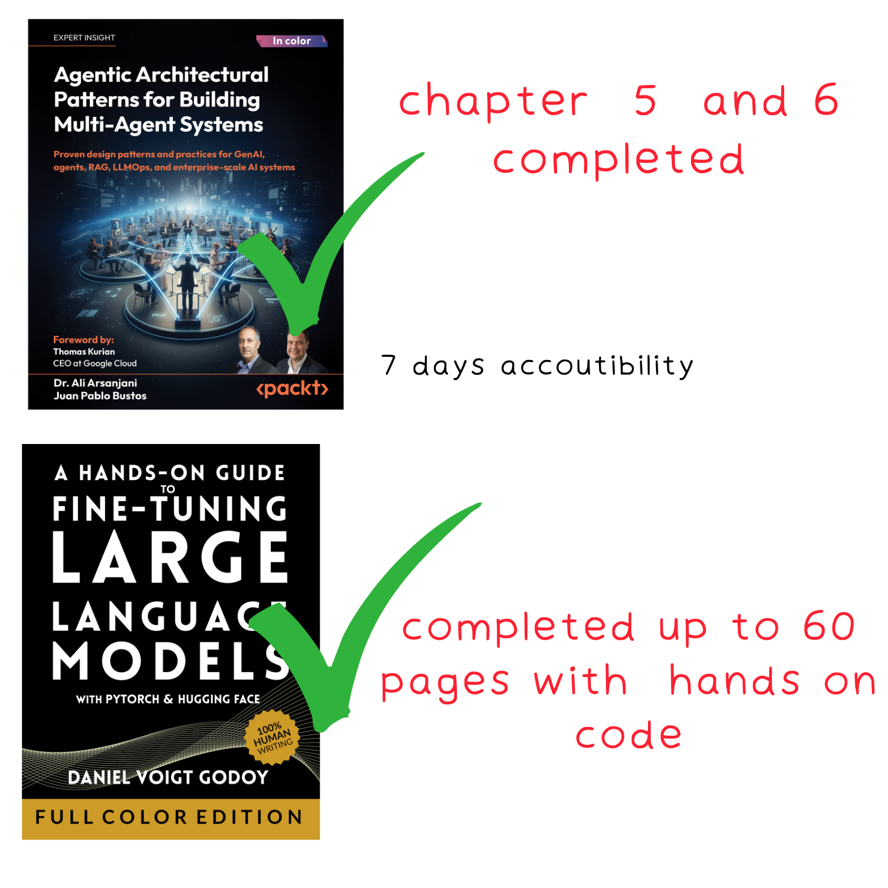
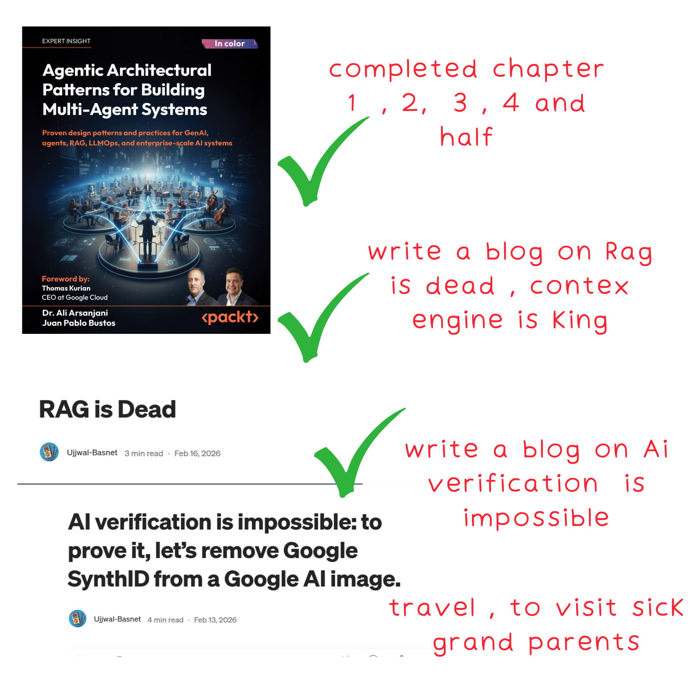
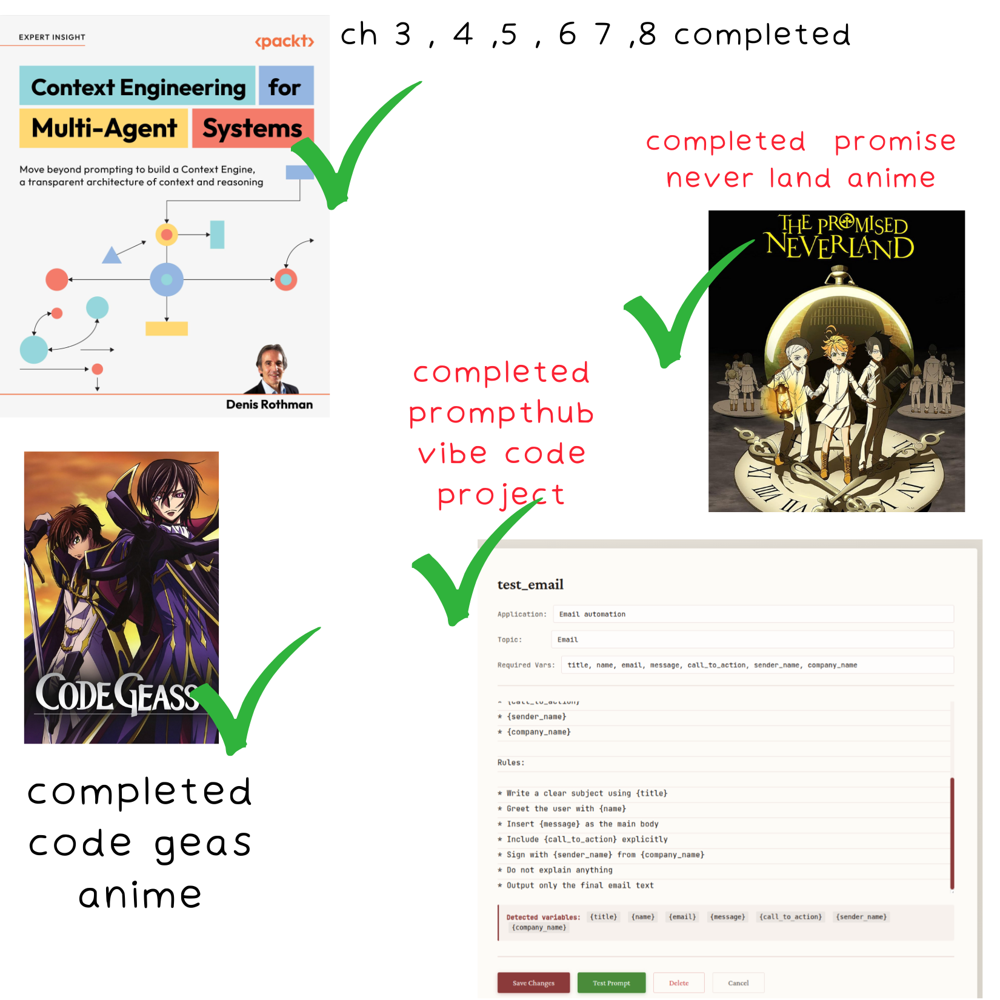
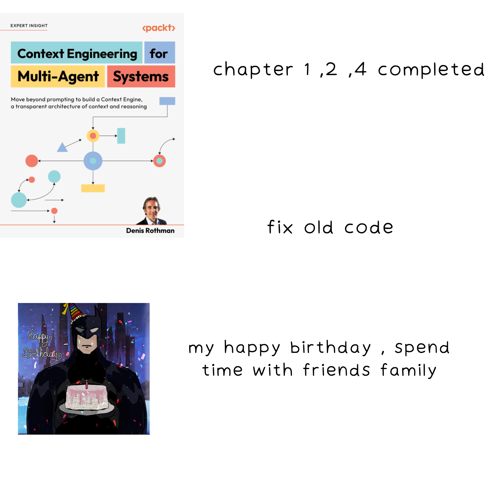

## i dont do anything on satuday
I never study or do anything productive on Saturdays — just games, anime, sleep, or chatting with friends.  
So in my personal tracking, I count a week as **8 days**.

---
---

## 🚀 (6–12 hrs/day)   latest Ai Grind
Okay, after 6 months I’m back this   
I was infact lockinn for this 6 months but  was too lazy   updating  here lol.

and also i was not at peak hrs because i was mostly focused on uni exams and clearing backlogs.  

but No worries , i did finish  some books like 
- prompt enginearing for llm (oreily) 100%
- Building apis for data science (oreily) - 100%
- managing memory (oreily)
- hands on apis for ai and datascience 
- oreily postgress sql / ai someting named book  
- and some packet publishing books like build ai agent ...
---

## year 2026
####  Here  are  my old 6-12 hrs ai grind promises and logs lol

***********************

### March 2026 

👉 🔗 [VIEW MY Mar 07-14 WEEK LOG](march-2026_week_logs/mar07_14.md)     completed ✅  

*********************** 

***********************
### February 2026
👉  feb 28 - march 6 :   DID'T COMPLETED anything  DUE TO ELECTION ... 

👉 🔗 [VIEW MY FEB 21-28 WEEK LOG](feb-2026…week_logs/feb21_28.md)  only able to complete some little things only ...  DUE TO ELECTION noise ... 

👉 🔗 [VIEW MY FEB 7-21 WEEK LOG](feb-2026…week_logs/feb7_21.md)  completed ✅  

---
***********************

### January 2026

- **[January 23–feb 7](jan-20206_week_logs/jan_23-30.md)** — completed ✅  

- **[January 14–21](jan-20206_week_logs/jan_14-21.md)**  completed ✅  

***********************
***********************

## year 2025  july month 
####  below are  my old 8-18 hrs grind promises and logs lol

👉 🔗 [VIEW MY WEEK 4 LOVE LETTER](20025_july_week_logs/week4.md)

👉 🔗 [VIEW MY WEEK 3 LOVE LETTER](20025_july_week_logs/week3.md)

👉 🔗 [VIEW MY WEEK 2 LOVE LETTER](20025_july_week_logs/week2.md)

####  Unplanned Work on week 3
Things that were not planned but still done:

- Build: https://github.com/ujjwal-basnet/server-location-visualization ✅  
- Two freelance projects ✅  

---

👉 🔗 [VIEW MY WEEK 1 LOVE LETTER](20025_july_week_logs/week3.md)
