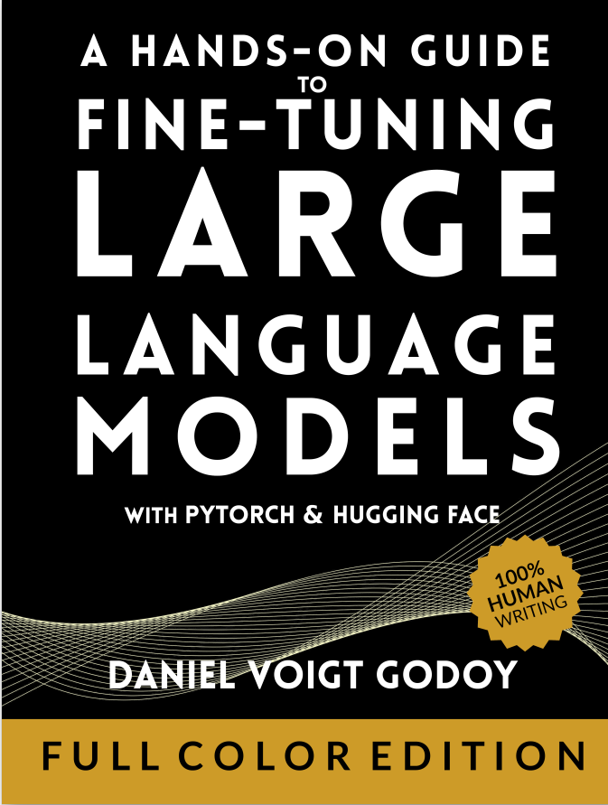

# Goals for this week

Feb 21 – Feb 28 (execution window)

Feb 21–22 📘

* Complete ch5
* Complete ch6
* Complete ch7 (mid)
* Create one video on Multi-Agent Architecture

Feb 23 💻

* Start hands-on guide to fine-tuning LLM

Feb 24 💻

* Continue hands-on guide to fine-tuning LLM

Feb 25 💻

* Continue fine-tuning LLM book
* Target: 150 pages in 3 days

Feb 26 🤖

* Complete agentic e-commerce initial version (using APIs)
* Apply A2A and A2UI components

Feb 27–28 🚀

* Continue GenAI project
* Push execution speed

Throughout week:

* Continue Nepal cricket fantasy app work

Status:

* Previous week rating: 2/10
