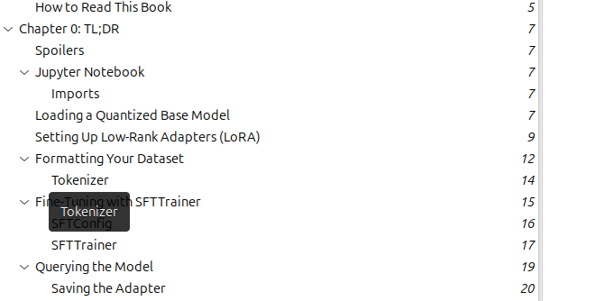
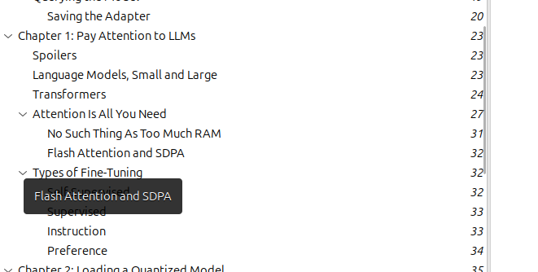
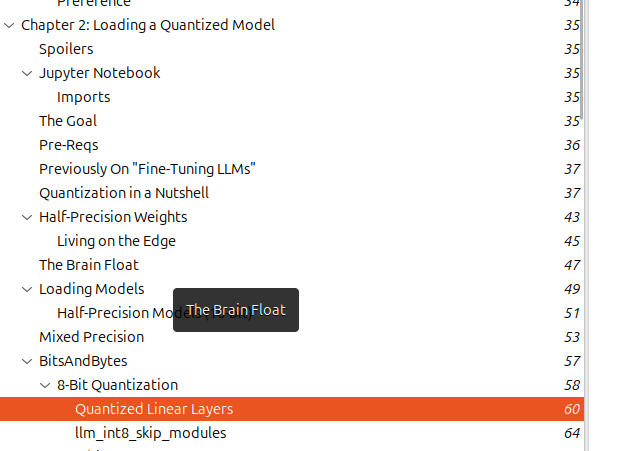
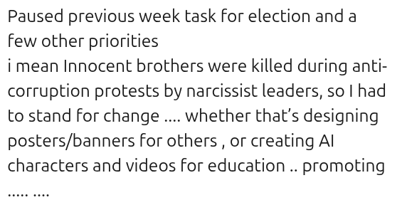

# Weekly Execution Log

**Execution Window:** Feb 21 – Feb 28  

---

## Objectives

### Feb 21 – 22 📘
- Read chapters 5, 6, 7 (mid) of *Agentic Architecture Patterns* book  
- Create one video  

**Accountability:**  
- Chapters 5 and 6 → Completed  
- Chapter 7 → Not completed  

---

### Feb 23 💻
- Start hands-on guide to fine-tuning LLM  

**Accountability:**  
- Chapter 0 → Completed  
- Evidence: 

---

### Feb 24 💻
- Continue hands-on guide to fine-tuning LLM  

**Accountability:**  
- Chapter 1 → Completed  
- Evidence: 

---

### Feb 25 💻
- Continue fine-tuning LLM book  
- Target: 150 pages in 3 days  

**Accountability:**  
- Target not met  
- Progress: ~60 pages only  
- Evidence: 

---

### Feb 26 🤖
- Build initial agentic e-commerce prototype using APIs  
- Apply A2A and A2UI components  

**Accountability:** Failed  

---

### Feb 27 – 28 🚀
- Continue GenAI project  
- Increase execution speed  

**Accountability:** Failed  

---

## Failure Analysis

---

## Performance Rating

- Previous week: 2/10  
- This week: 1/10