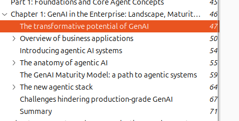
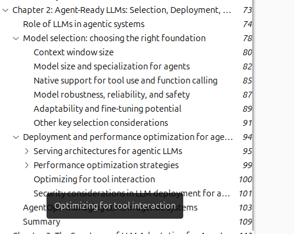
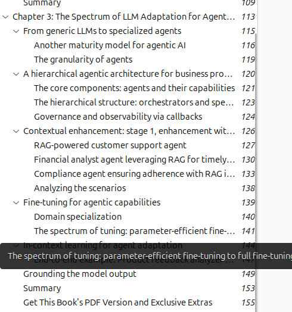
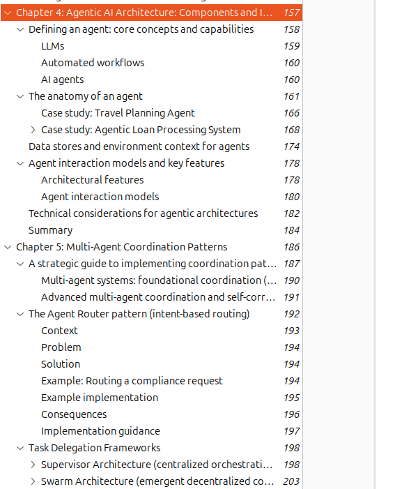

# Goals  for this week 
Feb 10 – Feb 16 (planned execution window)

Feb 10 📘  

    ch-2 & 3 Agentic Architecture Patterns (Multi-Agent Systems) (new book) 

Feb 11 🤖🧠  

    Continue agentic e-commerce
    build virtual try-on model (Deep Learning) (mid) + 
    dataset prep and LLM fine-tuning for SEO generation (optional).

Feb 12 💻  
Continue agentic e-commerce development.

Feb 13 🎥

    Create video: “3 Reasons AI Is Not Hype” + 
    integrate agents (system communication) +
    continue e-commerce build.

Feb 14 (saturday)
    Anime break.

Feb 15   
Continue project + revise Chapter 5.

Feb 16 ✅  
Project completion (final integration ) 

feb 17 : create another video (may be )

 **throughout week , working on nepal cricket fantasy app is** 

*****  till feb 16 was a  goal but it somehow continue till ,  feb 21 so gona say worst week 
Accountability Update (Jan 23 – Jan 30)

Feb 10 📘   (completed ch1 )✅
 

feb 11: completed ch2 ✅

feb 12: research on how to train and make ai adds on own dataset 

feb 13 : ch3 ✅ (book , agentic architecture pattern for building multi agent system)

write blogg : i have found a method to bypass google ai image detection system 
https://medium.com/@ujjwal-basnet-ml/ai-verification-is-not-a-detection-problem-it-is-a-cooperation-problem-dc7b763e80ac

feb 14: noting i say 

feb 15: noting waste my time, distracted from goals and started writing blog 

feb 16: just write completed one blog noting much dissapointed  : 
https://medium.com/@ujjwal-basnet-ml/rag-is-dead-0a5ee89e94bc

feb 17: ch4, ch5(half)

feb 18: travel to home to help my dad for honey harvesting , prepare honey harvesting  materials , clean prepare ... fix schedule, manage ... etc

feb 19: honey harvesting 

Feb 20: Got sick due to heavy work (honey harvesting from 58 beehives), cold weather, and travel during those days 

feb 21: went to hospital , feeling  now good , now gona start from tmrw

conclusion : not good, may be 2/10 week lol  gota locking more 