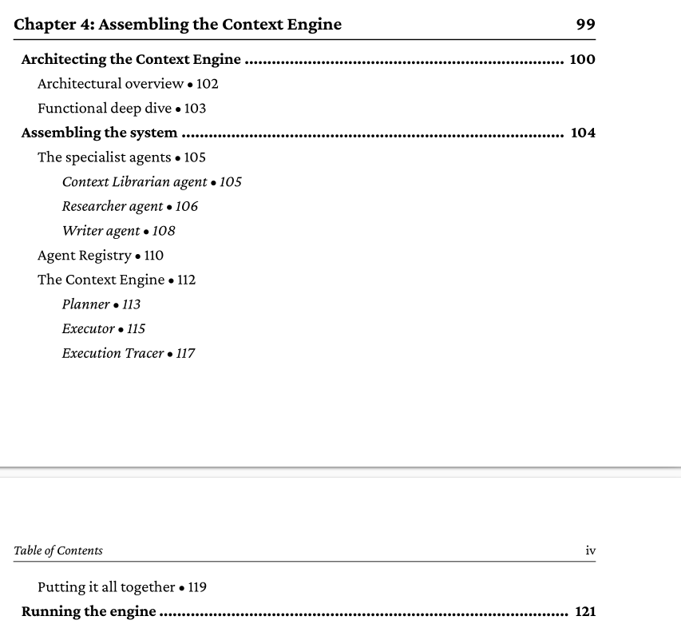
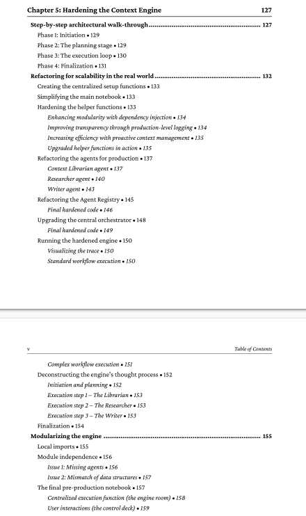
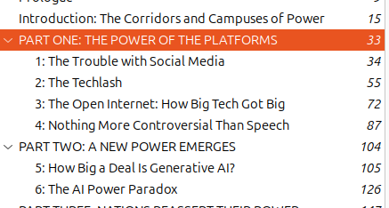
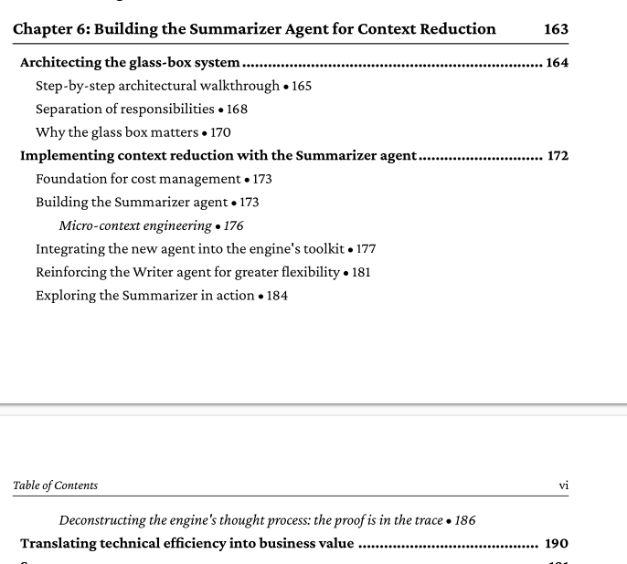
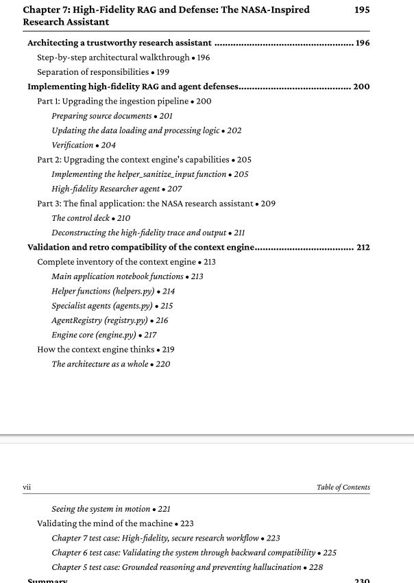
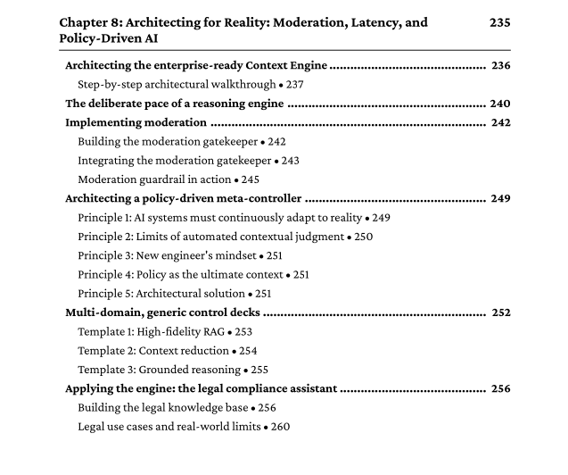
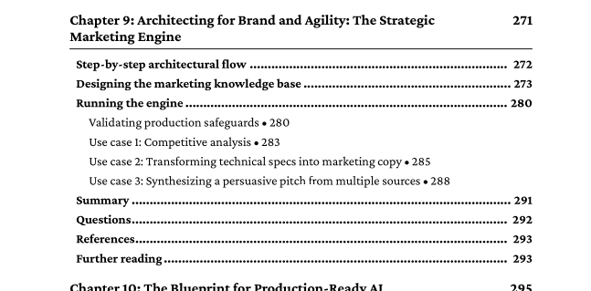

# Goals
Jan 23 – Jan 30 ( this are the thing i supposed to do this in beteen 23-30 jan)

Jan 23 🎯
Fix all errors from Context Engineering Chapter 3.

Jan 24 📘
Complete Context Engineering Chapter 4.
Assembling the Context Engine.

Jan 25 🔧
Complete Context Engineering Chapter 5.
Hardening the Context Engine.

Jan 26 🧪📂
Prepare 6th Semester practical files.
Viva preparation.

Jan 27 📝
Viva exams.

Jan 28 📝
Viva exams.

Jan 29 📝
Viva exams.

Jan 30 📝
Viva exams.

Jan 27 – Jan 30 🔁💻
Continue project: Dream11-alike for Nepali cricket.
Focus on data processing.

# Accountability Update (Jan 23 – Jan 30)

Here I will share what I actually did each day and whether I completed the planned tasks.
---- 

 jan 23 : chapter 3 done (completed task) ✅ 
- [contex aware agent](https://github.com/ujjwal-basnet/Context-Enginnering/blob/main/contex_aware_agent_4.2.ipynb)✅   
-   [helper function](https://github.com/ujjwal-basnet/Context-Enginnering/blob/main/helper.py)✅ 
-   [prompts.py](https://github.com/ujjwal-basnet/Context-Enginnering/blob/main/prompt.py)✅ 

jan 24: i completed chapter 4 ✅ 

jan 25: i completed  chapter 5  ✅✅

also completed  1,2 of book how to save internet (using notebook llm )  ✅✅

jan 26 : i am completing chapter 6 
(did't read too much so not completed lol  )

jan 27 : no cooding, only able to prepare for viva reports  

jan 28 : viva  

jan 29 : viva 

jan 30 : completed chapter 6, also chapter 7 , 8  ✅✅

jan 31 : did nothing 

feb 1  : started creating production ready step by step project 

completed :  
setup project and files 
addedd :
https://github.com/ujjwal-basnet/Context-Enginnering/blob/context_engine_ch_4/app/db/client.py

also serach , work on making it robost llm client 

feb 2 : work on contex engine 

feb 3 : no cooding , anime code geass 

feb 4 : anime completed anime code gease and  the promise never land 

feb 5 :  did fun project MY PROMPT HUB WITH CHATGPT ASSISTANT
https://github.com/ujjwal-basnet/myprompthub

feb 6 and 7 : working on ecommmerce automation project  
adding featuers like automatically fb post , virtual try on  , auto cart and all ...   

also try chatgpt local and hosted mcp , so that later i will connect my e commerce agent to mcp 
https://github.com/ujjwal-basnet/SmartShop_Assistant
