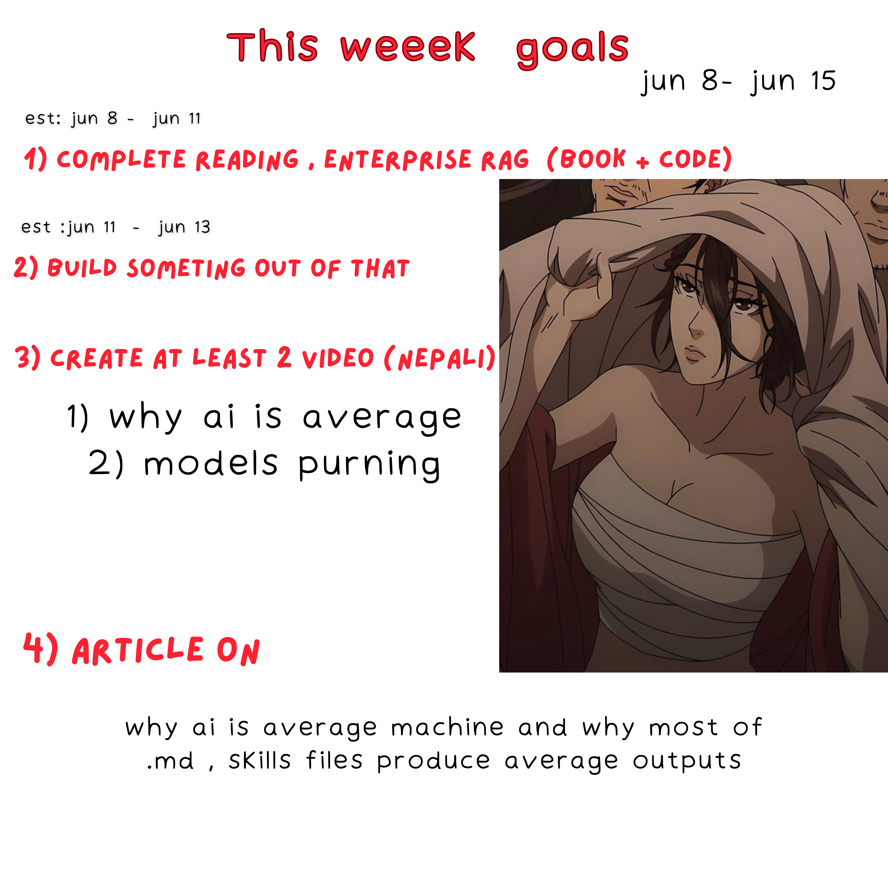

# Weekly Goals

**Execution Window:** Jun 9 - Jun 15, 2026

> Goal card says Jun 8 - Jun 15, but this log is tracked as Jun 9 - Jun 15.

---

## Planned Goals

### Jun 9 - Jun 11

**Goal:** Complete reading **RAG-Driven Generative AI: Build MAS-RAG with DualRAG, GraphRAG, multimodal video pipelines, and Oracle Database 23ai, Second Edition** by Denis Rothman.

**Scope:**
- Finish the book reading
- Complete the code examples
- Extract useful implementation notes
- Keep notes for ideas that can become a project

**Accountability:** Pending

---

### Jun 11 - Jun 13

**Goal:** Build something from **RAG-Driven Generative AI**.

**Scope:**
- Pick one useful idea from the book/code
- Build a small working prototype
- Push/update code on GitHub if possible
- Keep the project practical, not just reading notes

**Accountability:** Pending

---

### Jun 13 - Jun 15

**Goal:** Create at least two Nepali videos.

**Video Topics:**
- Why AI is average
- Model pruning

**Accountability:** Pending

---

### Jun 15

**Goal:** Write article.

**Article Topic:**
Why AI is an average machine and why most `.md` / skill files produce average outputs.

**Accountability:** Pending

---

## Final Accountability

**Week Rating:** Pending

**Completed:**
- Pending

**Failed / Missed:**
- Pending

**Notes:**
- Pending
